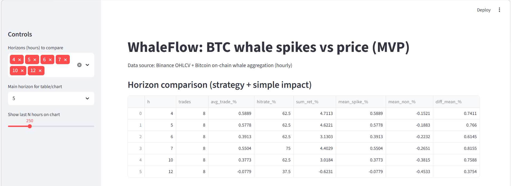
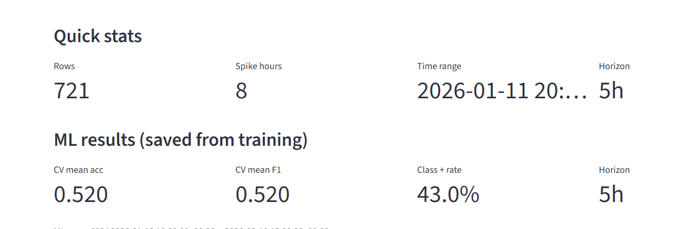
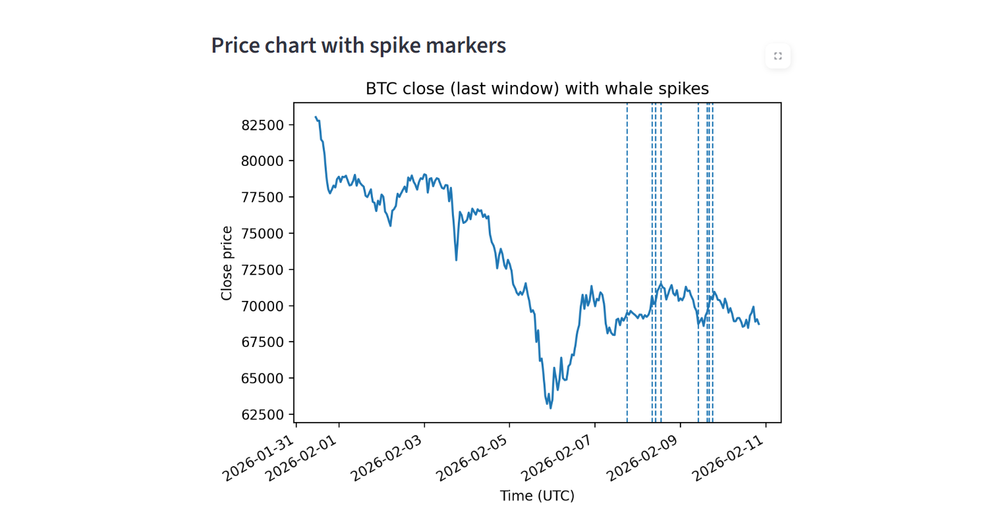
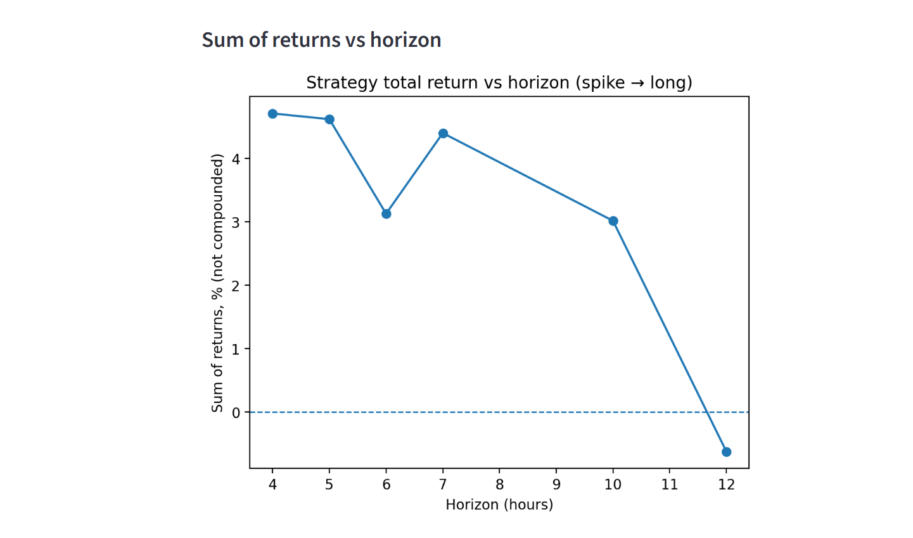
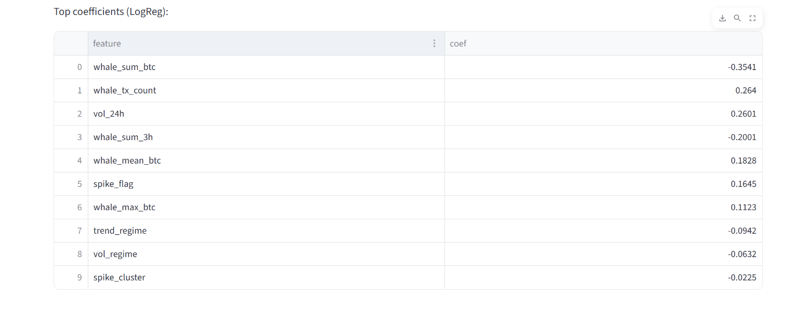

<h1 align="center">WhaleFlow 🐋📈</h1>

  <b>BTC whale activity vs price movement</b> 
  On-chain aggregation • Time-series features • ML baseline • Streamlit dashboard

  
  
  
  

  

# WhaleFlow 🐋📈
### BTC whale spikes vs price movement (Data Science / ML project)

WhaleFlow explores whether **large Bitcoin whale transactions** correlate with **future BTC price movements**.

The project aggregates on-chain whale activity, merges it with market data, and evaluates whether **price tends to move after whale spikes** across multiple time horizons.

The repository includes:

- on-chain whale transaction aggregation
- time-series feature engineering
- statistical impact analysis
- a machine learning baseline model
- an interactive **Streamlit dashboard**

---

# Dashboard

## Quick stats

Shows dataset size, spike count, and ML training summary.

---

## Horizon comparison

Comparison of strategy performance across multiple horizons (1–12 hours).

Metrics shown:

- number of trades
- average trade return
- hitrate
- cumulative strategy return
- mean returns after whale spikes vs normal hours

---

## Whale spikes vs BTC price

BTC price chart with whale spike markers.

Spike hours represent the **largest whale transaction flows**.

---

## Strategy performance vs horizon

Shows how strategy performance changes depending on the prediction horizon.

---

## ML feature importance

Logistic Regression coefficients highlighting the most influential features.

---

# Project Pipeline

### 1️⃣ Whale transaction aggregation
Large Bitcoin transactions are extracted and aggregated hourly.

Features include:

- whale_tx_count
- whale_sum_btc
- whale_max_btc
- whale_mean_btc

A **spike hour** is defined as the **top 10% of whale transaction flow**.

---

### 2️⃣ Feature engineering

Additional features:

- whale_sum_3h (3-hour rolling whale flow)
- spike_cluster (recent spike activity)
- volatility regime
- trend regime

---

### 3️⃣ Impact analysis

Statistical tests compare:

future returns after spike hours
vs
future returns after normal hours

Bootstrap resampling is used to estimate **95% confidence intervals**.

---

### 4️⃣ Machine learning baseline

Model used:

Logistic Regression

Target:

Will BTC price increase within N hours?

Training setup:

- TimeSeriesSplit cross-validation
- feature scaling
- class balancing

Evaluation metrics:

- Accuracy
- F1 score

---

# Example findings

Some horizons show stronger effects than others.

Short-term horizons around **4–7 hours** showed the most promising signal in this dataset.

However, the project is intended as an **exploratory research prototype**, not a trading system.

---

# Tech Stack

Python

Libraries:

- pandas
- numpy
- scikit-learn
- matplotlib
- streamlit
- pyarrow

---

# Project Structure
WhaleFlow

│

├── src

│ ├── app.py

│ ├── data_price.py

│ ├── features_whales_hourly.py

│ ├── build_dataset_btc.py

│ ├── impact_check.py

│ ├── train_ml_btc.py

│

├── assets

│ ├── quick_stats.png

│ ├── price_spikes.png

│ ├── horizon_comparison.png

│ ├── strategy_vs_horizon.png

│ ├── top_coef.png

│

├── data

│ ├── raw

│ ├── processed

│

├── requirements.txt

└── README.md

---

# Running the project

- Create virtual environment

python -m venv .venv

- Activate

.venv\Scripts\activate

- Install dependencies

pip install -r requirements.txt

- Run dashboard

streamlit run app.py

---

# Disclaimer

This project is for **research and educational purposes only**.

It demonstrates a **data science workflow combining blockchain data, statistical analysis, and machine learning**.

It is **not financial advice** and should not be used for trading decisions.
